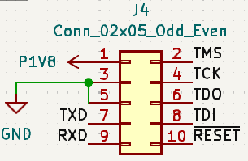

# JTAG translator using UPduino

We have an FTDI FT232 on the UPduino which is what is typically used in various JTAG debuggers. The ICE40 FPGA enables level translation as well as a UART interface which is typically used for debugging.

## Connections:
1. Cut the Bank 2 VIO sel jumper and short it to VIO. This allows the FPGA bank to be powered from the VIO pin which can be set to the VREF signal from the JTAG port.
2. Make the following connections:

  | Signal | Pin     |
  |--------|---------|
  | TCK    | gpio_2  |
  | TDI    | gpio_47 |
  | TDO    | gpio_46 |
  | TMS    | gpio_45 |
  | RXD    | gpio_48 |
  | TXD    | gpio_3  |
  | RSTn   | gpio_4  |
  | Ground | Ground  |
  | VIO    | VREF    |

In case the target is a 1.8V system, a cheap way to avoid the VREF line is to use a resistive voltage divider to source the VIO pin. This isnt optimal but should work since the power draw from the IO is pretty small. Use 2 470 ohm resistors to divide the 3.3V which will result in 1.65V as the logic level, not ideal but close.

Mapping to the FPGA pins:

| Pin | Signal | Pin | Signal |
|-----|--------|-----|--------|
| 1   | Vref   | 2   | TMS (45) |
| 3   | GND    | 4   | TCK (2) |
| 5   | GND    | 6   | TDO (46) |
| 7   | TXD    | 8   | TDI (47) |
| 9   | RXD    | 10  | RSTn (4) |

## Pogo probe adapter

While its nice to have a standard 10 pin JTAG connector, this takes up significant board space. By moving these pins to a series of pads, we can save space. Alterntively, these can be moved as castellations on the edge of the board to save even more space.

A pogo probe connector such as [854-22-006-20-041101 from Millmax](https://www.digikey.com/en/products/detail/mill-max-manufacturing-corp/854-22-006-20-041101/24634760?s=N4IgTCBcDaIBwFYAsBaMYUAZMDY2ayQEYjMiQBdAXyA) makes a robust way to connect to the debug pads.

